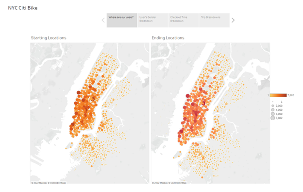
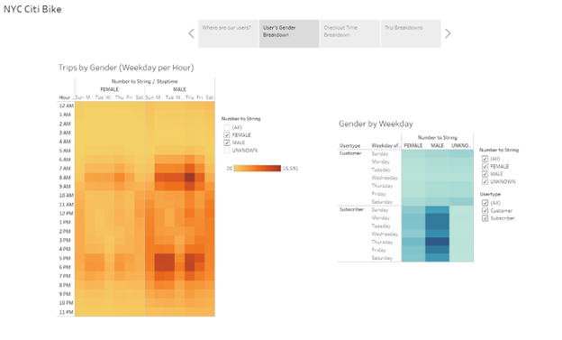
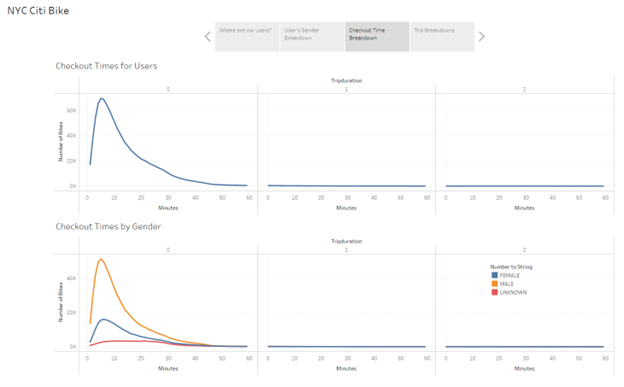
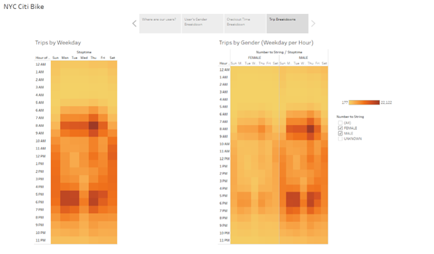

# bikesharing

## Overview
The purpose of this analysis was to analyze provided CitiBike data and create visualizations outlining 
various factors involved with bikesharking in New York City. 

## Results

  
[Link to Dashboard](https://public.tableau.com/app/profile/emily.stevens7082/viz/CitiBikeData_16538688944390/NYCCitiBike?publish=yes)

## Summary
### Geographic Analysis
The majority of rides currently take place in south Manhattan, which aligns well with the tourism districts. 
Further analysis may be required to investigate whether the northern portion of Manhattan is at peak activity for the area, or if more efforts need to be put in place to build out the infrastructure there. 

### Gender Analysis
The largest demographic of riders throughout the week are males who are subscribed to the service. 
The largest usage surges during the week appear to be during rush hours (6am-10am, 5pm-7pm) Monday through Friday. 
Further analysis may be required to investigate this gap in gender, as there may be a failure in marketing. 
In addition, it is advised that the age of the female demographic of users should be investigated to determine whether the low usage rates have to do with old fears regarding city safety, or if the cause is something entirely different. 

### Time Analysis
Men checked out bikes for the largest amount of time, as compared against women and unknown. 
Men checked out bikes at over twice the rate of women. 
Further analysis is needed to investigate why women do not use the service as much as men. 

### Trip Analysis
There appears to be a decrease in usage of bikes during the weekend, likely aligning with the lack of a weekend commute cycle. 
Further investigation should be done for marketing purposes to investigate ways to advertise weekend bicycling. Survey data may be necessary. 
